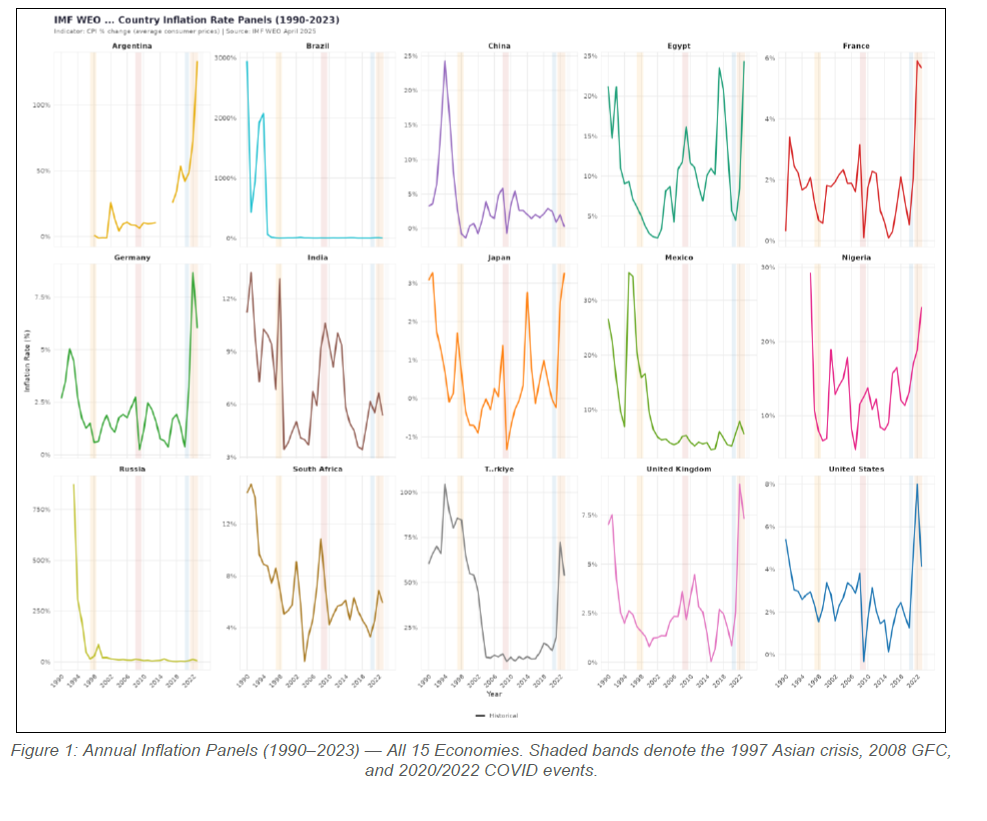
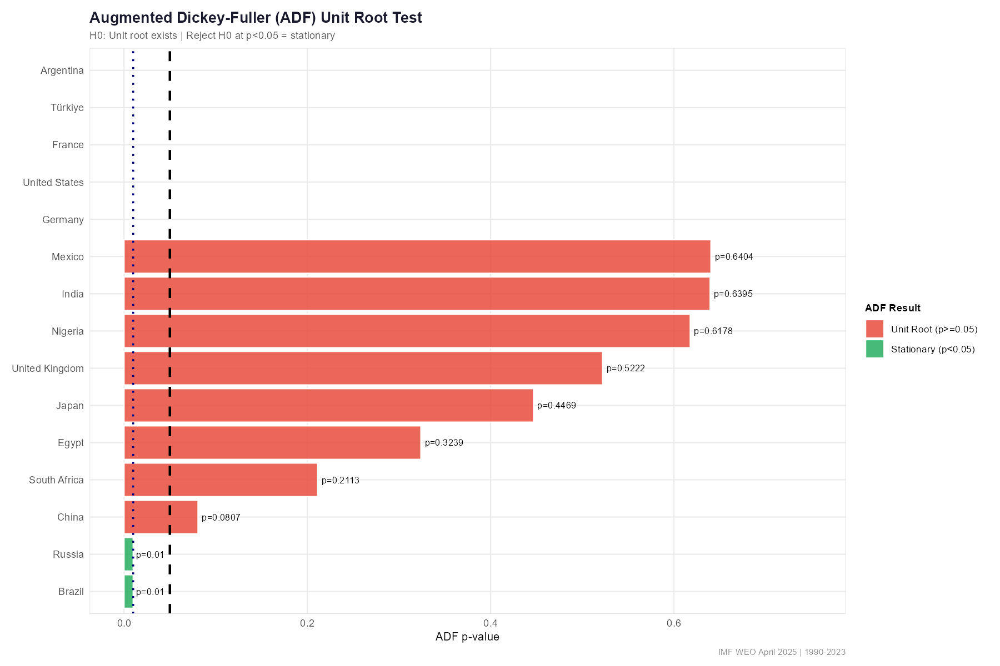
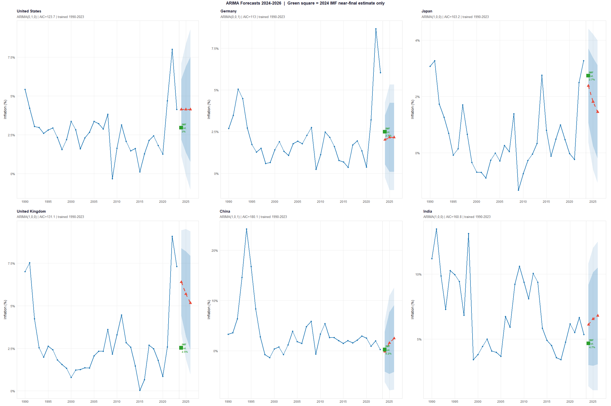
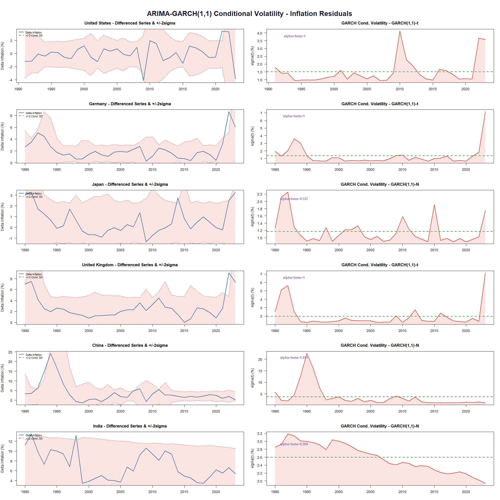
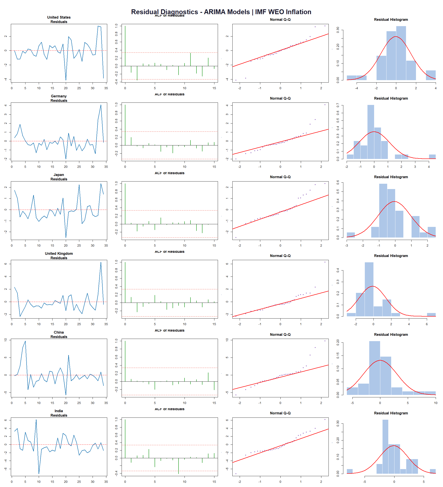

# IMF-Inflation-Forecasting-ARIMA-GARCH
Advanced time-series forecasting and volatility modeling of global inflation using ARIMA, GARCH, and IMF WEO macroeconomic data.

# 📈 IMF Inflation Forecasting using ARIMA & GARCH Models

## 🚀 Overview

This project performs advanced time-series forecasting and volatility analysis on global inflation data using:

- ARIMA models
- GARCH volatility models
- IMF World Economic Outlook (WEO) data
- Econometric diagnostics
- Forecast benchmarking

The study analyzes inflation dynamics across multiple economies between 1990 and 2024 and evaluates the predictive capability of univariate forecasting models under both normal and crisis conditions.

---

# 🎯 Problem Statement

Inflation forecasting is a critical component of:

- Monetary policy
- Sovereign debt management
- Investment strategy
- Macroeconomic planning
- Financial market stability

This project investigates:

> "How accurately can historical inflation data alone predict future inflation?"

using purely univariate time-series methodologies.

---

# 🌍 Dataset

Source:

- IMF World Economic Outlook (WEO), April 2025

Coverage:

- 15 economies
- 1980–2024

Primary modeled countries:

- USA
- Germany
- Japan
- United Kingdom
- China
- India

:contentReference[oaicite:7]{index=7}

---

# 🧠 Core Techniques Used

## Time-Series Forecasting

- ARIMA
- Auto ARIMA
- Grid-search ARIMA selection

---

## Volatility Modeling

- ARCH tests
- GARCH(1,1)
- GARCH(1,2)
- EWMA volatility estimation

---

## Statistical Diagnostics

- ADF Test
- KPSS Test
- Phillips-Perron Test
- Residual diagnostics
- Structural break analysis
- CUSUM tests

---

# 🏗️ Project Pipeline

```text
IMF WEO Data
      ↓
Data Cleaning & Validation
      ↓
Stationarity Testing
      ↓
ARIMA Identification
      ↓
Forecast Evaluation
      ↓
Residual Diagnostics
      ↓
ARCH/GARCH Modelling
      ↓
Visualization Dashboard
```

---

# 📊 Key Features

- 📈 Inflation forecasting
- 📉 Volatility analysis
- 🌍 Multi-country macroeconomic modeling
- 🧠 Econometric diagnostics
- 📊 Forecast benchmarking
- 🔬 Structural break testing
- 📉 Forecast evaluation metrics
- 📚 Research-grade visualization pipeline

---

# 🧩 Tech Stack

| Category | Technology |
|---|---|
| Programming | R |
| Forecasting | ARIMA |
| Volatility Modeling | GARCH |
| Visualization | ggplot2 |
| Statistical Testing | tseries / urca |
| Data Processing | dplyr / tidyr |
| Forecasting Libraries | forecast |
| Econometrics | lmtest / strucchange |

---

# 📁 Project Structure

```text
IMF-Inflation-Forecasting-ARIMA-GARCH/
│
├── data/
├── scripts/
├── reports/
├── screenshots/
├── plots/
├── README.md
├── requirements.txt
└── LICENSE
```

---

# 📸 Visualizations

## Global Inflation Panels



---

## Stationarity Tests



---

## Forecast Output



---

## GARCH Volatility Analysis



---

---

## Residual Diagnostics



---

# ⚙️ Installation

## Clone Repository

```bash
git clone https://github.com/YOUR_USERNAME/IMF-Inflation-Forecasting-ARIMA-GARCH.git
```

---

## Install Required Packages

```r
install.packages(c(
  "ggplot2",
  "dplyr",
  "tidyr",
  "forecast",
  "tseries",
  "urca",
  "fGarch"
))
```

---

# ▶️ Running the Project

Run the main R script:

```r
source("scripts/imf_inflation_analysis.R")
```

The pipeline automatically performs:

- preprocessing
- stationarity testing
- ARIMA fitting
- GARCH modeling
- diagnostics
- forecasting
- plot generation

---

# 📊 Statistical Methodology

## Stationarity Testing

The project applies:

- Augmented Dickey-Fuller (ADF)
- KPSS
- Phillips-Perron (PP)

to identify integration order and determine differencing requirements.

:contentReference[oaicite:8]{index=8}

---

## ARIMA Model Selection

The framework uses:

- Auto ARIMA
- Exhaustive grid search
- AICc optimization
- Out-of-sample RMSE evaluation

:contentReference[oaicite:9]{index=9}

---

## Volatility Analysis

Conditional heteroscedasticity is modeled using:

- ARCH-LM tests
- GARCH(1,1)
- Student-t volatility estimation

:contentReference[oaicite:10]{index=10}

---

# 📈 Forecast Evaluation

Evaluation metrics include:

- RMSE
- MAE
- sMAPE
- Skill Score

The project separately evaluates:

✅ Pre-COVID forecasting performance  
✅ COVID-era stress-test robustness

:contentReference[oaicite:11]{index=11}

---

# 💡 Key Findings

- Most economies exhibited non-stationary inflation dynamics
- First differencing was required for ARIMA modeling
- ARIMA models performed well during stable macroeconomic periods
- Forecast performance degraded during COVID structural breaks
- GARCH effects were limited due to annual data frequency

---

# 📚 Research Contributions

This project demonstrates:

✅ Practical econometric forecasting  
✅ Inflation volatility modeling  
✅ Multi-country macroeconomic analysis  
✅ Production-grade time-series pipelines  
✅ Crisis-period forecasting evaluation

---

# 🔮 Future Enhancements

- VAR / ARIMAX models
- Deep learning forecasting
- Exogenous macroeconomic variables
- Monthly inflation datasets
- Regime-switching models
- Bayesian time-series forecasting

---

# 👨‍💻 Contributors

- A Ravichandra
- Aman Kalra
- Pruthvi Patel
- A Atul
- Divya Jain

---

# 🎓 Academic Context

Developed as part of:

**MPBA G512 — Time Series Analysis and Forecasting**  
Birla Institute of Technology and Science, Pilani

---

# 📄 Report

Full academic report included:

```text
reports/Group9_TS_Inflation_imf.pdf
```

---

# 📜 License

This project is developed for academic and research purposes.

---

# ⭐ Support

If you liked this project:

⭐ Star the repository  
🍴 Fork the repository  
📢 Share feedback

---

# 🚀 Final Note

This project combines:

```text
Econometrics + Time-Series Forecasting + ARIMA + GARCH + Macroeconomic Analytics
```

to build a research-grade inflation forecasting and volatility modeling framework using IMF macroeconomic data.
